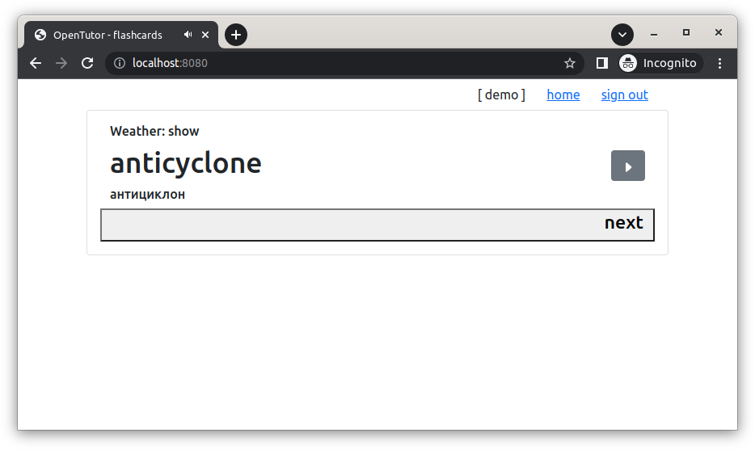

## OpenTutor :: a flashcard system to learn words

A simple opensource application that provides flashcards to learn foreign words.    
It is supposed to be similar to Lingvo Tutor.    
This is a training project, which is used to demonstrate modern kotlin-stack-based technologies and approaches.

## OpenTutor :: proposed structure and details of the project

It is assumed that the backend will consist of two parts:
- the speaker - a text-to-speech service-adapter, which will be able to extract audio resources from the underlining cache-like store or/and other sources
- the tutor - an application body: logic with flashcards; the speaker can be integrated into it as a microservice or/and in the form of dependency or/and git-submodule. 

## OpenTutor :: marketing

The target audience is confident internet surfers with interests in learning language, which are probably familiar with lingvo-tutor.

#### Hypothetical portrait of the service's customers

- an educated purposeful person 
- male or female from 40+ years old
- whose work is connected with the Internet, and which probably belongs to the technical field
- who values a systematic approach to learning
- who is probably familiar with the original lingvo-tutor
- who values the correct pronunciation
- who is passionate about reading books in a foreign language (both technical and fiction)
- who would like to have a convenient facility for creating their own subject dictionaries with their own phrase samples
- who don't like modern funny tools and services, that aimed at children and students

#### OpenTutor vs Lingvo Tutor

- OpenTutor will be a new service (or\and app), while Lingvo Tutor is an old software 
- OpenTutor can be run as a docker container everywhere, while Lingvo Tutor is a windows only program  
- OpenTutor is an opensource, Lingvo Tutor is proprietary tool
- OpenTutor is a service a designed to learn words only, that only one function, Lingvo Tutor is not independent tool, it is an addition to Lingvo Dictionaries
- Modern TTS services offers a way to get a wav with good pronunciation almost for every word, LingvoTutor uses built-in vocabularies with limited number of words
- There are plenty of enhancements and features which could be implemented to make OpenTutor really useful tool for learning words, Lingvo Tutor is not developing any more 

## OpenTutor :: MVP

MVP exists, and it is runnable, the project home is https://gitlab.com/sszuev/flashcards

#### The main page (dictionaries): 

#### Tutor page, show stage:

## OpenTutor :: project structure

#### Endpoints

- CRUDS for dictionaries
- CRUDS for cards + methods to update learn status

#### Entities

- Dictionary
    - name
    - source lang
    - target lang
    - language details (for target lang)
    - statistics (total words count/learned words count)
    - per dictionary settings
- Card 
    - word
    - transcription
    - resource (audio)    
    - part of speech
    - translations
    - examples
    - statistics (number of right answers per stage and total)
- Settings
    - number of attempts to learn
    - enabled tutor stages
    - etc
