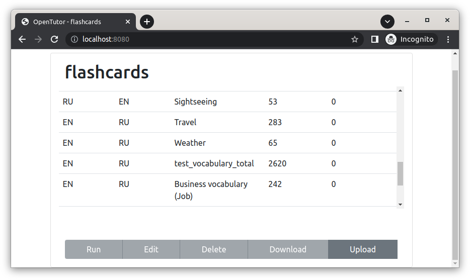

## OpenTutor - a service for compiling user dictionaries and learning foreign words

A simple open-source kotlin-ktor application for compiling custom dictionaries and learning foreign words through flashcards.         
It is supposed to be an extended analogue of the desktop program *Lingvo Tutor*, which is a component of well-known [ABBYY Lingvo](https://www.lingvo.ru/multi/).

This is a second edition, the first one is a java-spring application, which home is [here](https://gitlab.com/sszuev/flashcards)

#### Requirements: 
- java-11+
- gradle-7+
- docker

#### Build and run:
- [app-ktor/README](./app-ktor/README.md)

#### License:
- Apache License Version 2.0

#### Example (dictionaries):

