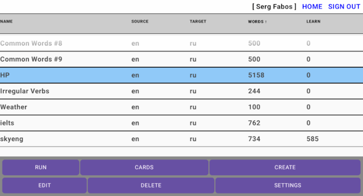
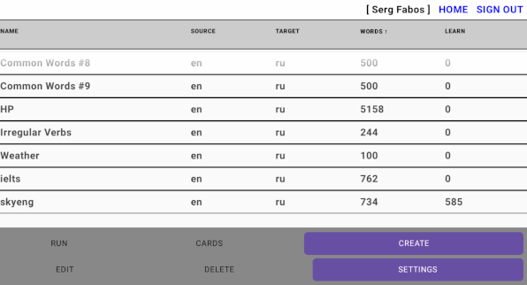

## OpenTutor - a service for compiling user dictionaries and learning foreign words

A simple open-source kotlin-ktor web-application for compiling custom dictionaries and learning foreign words through
flashcards.

It is available via [https://opentutor.zapto.org](https://opentutor.zapto.org) ;
also, as an apk android file (see [releases](https://github.com/crowdproj/opentutor/releases))
and as a standalone docker image
(see [docker-hub](https://hub.docker.com/repository/docker/sszuev/open-tutor-standalone/)).

#### Edit dictionaries:

#### Run flashcards:

#### Requirements (for dev):

- java-17+
- gradle-7+
- docker

#### Build and run:

- for standalone version see [app-ktor/README](./app-ktor/README.md)
- for prod version see [tutor-deploy/README](./tutor-deploy/README.md)

#### License & Privacy Policy:

- Apache License Version 2.0
- [Privacy Policy](https://crowdproj.github.io/opentutor/privacy.html)
